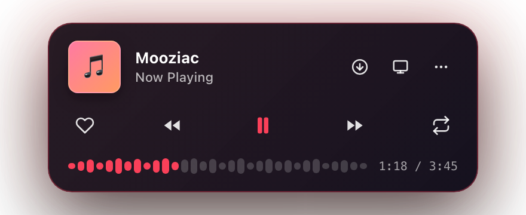
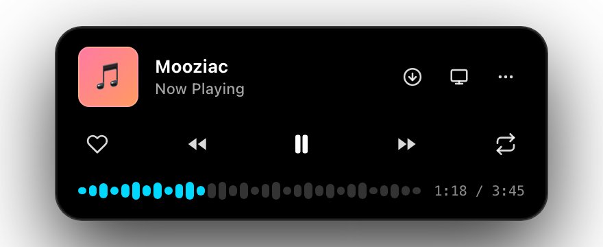
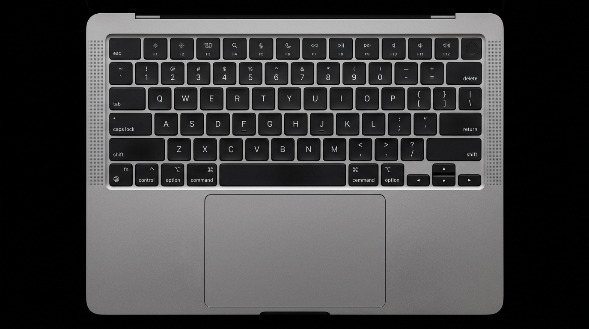

<p align="center">
  <a href="https://mooziac.threeten.site">
    
  </a>
</p>

<p align="center">
  <a href="https://mooziac.threeten.site"></a>
  <a href="https://github.com/shirkeharsh/mooziac/releases/latest"></a>
  <a href="https://github.com/shirkeharsh/mooziac/releases/latest"></a>
  <a href="https://github.com/shirkeharsh/mooziac/releases/latest"></a>
  <a href="LICENSE"></a>
  <a href="#-privacy-first-architecture"></a>
</p>

<p align="center">
  <a href="https://github.com/shirkeharsh/mooziac/releases/latest/download/Mooziac.dmg">
    
  </a>
  &nbsp;&nbsp;
  <a href="https://github.com/shirkeharsh/mooziac/releases/latest/download/Mooziac.zip">
    
  </a>
  &nbsp;&nbsp;
  <a href="https://mooziac.threeten.site">
    
  </a>
</p>

<br>

<p align="center">
  
</p>

---

## ⚡ What is Mooziac?

**Mooziac** is an ultra-lightweight, open-source macOS music player engineered from the ground up in **pure Swift 5.9 and AppKit**. 

Instead of running heavy web browser tabs or resource-hungry Electron wrappers, Mooziac docks discreetly in your Mac’s menu bar. It delivers instantaneous playback controls, seamless **YouTube Music** integration, an offline lossless audio engine, live synchronized lyrics, and innovative trackpad edge volume gestures — all while consuming a fraction of the RAM and battery of standard players.

---

## 📊 Performance Comparison

Why run an 800 MB browser tab just to listen to music?

| Metric / Capability | 🌐 Browser Tab (Chrome / Safari) | 📦 Electron Desktop Wrappers | ⚡ **Mooziac (Native Swift)** |
| :--- | :---: | :---: | :---: |
| **Active Memory (RAM)** | ~450 MB – 850 MB | ~500 MB – 950 MB | **~114 MB – 122 MB** |
| **Idle CPU Usage** | 8% – 18% | 6% – 15% | **0.5% – 1.8%** |
| **UI Rendering Engine** | Heavy Web DOM | Chromium Compositor | **Pure Liquid-Glass AppKit** |
| **Trackpad Edge Gestures** | ❌ None | ❌ None | **✅ Hardware MultiTouch Engine** |
| **Menu Bar Integration** | ❌ None | ⚠️ Minimal / Web-based | **✅ Dynamic Island Floating Pill** |
| **Live Synced Lyrics HUD** | ⚠️ In-page only | ⚠️ In-page only | **✅ Anchored Menu Bar HUD** |
| **Power & Sleep Awareness** | ❌ Keeps tabs awake | ❌ Heavy wake locks | **✅ Native IOKit Power Assertions** |
| **Telemetry & Privacy** | ❌ Google Tracking & Ad Scripts | ⚠️ Embedded Telemetry | **✅ 100% Local-First / Zero Trackers** |

---

## 🌟 Core Features

<table>
  <tr>
    <td width="50%" valign="top">
      <h3>🏝️ Dynamic Island Player</h3>
      <ul>
        <li><b>Pixel-Perfect 8px Grid:</b> Strict alignment across 3 rows without overlap or text clipping.</li>
        <li><b>Real-Time Waveform Seeker:</b> Interactive audio wave rendering with scrub-and-drag seeking.</li>
        <li><b>Ambient Chromatic Glow:</b> Dynamically samples primary colors from active album art.</li>
        <li><b>Micro-Spring Physics:</b> Smooth Apple-style spring animations on playback actions.</li>
      </ul>
    </td>
    <td width="50%" valign="top">
      <h3>🖐️ MultiTouch Edge Slider</h3>
      <ul>
        <li><b>1mm Right-Edge Volume:</b> Slide along the rightmost trackpad edge for smooth volume adjustment.</li>
        <li><b>Tactile Haptic Feedback:</b> Subtle haptic ticks as system volume rises and lowers.</li>
        <li><b>Corner Tap Shortcuts:</b> Double/triple tap trackpad corners to skip tracks or play/pause.</li>
        <li><b>Safety Velocity Clamping:</b> Touch ID & single-finger filters prevent false triggers.</li>
      </ul>
    </td>
  </tr>
  <tr>
    <td width="50%" valign="top">
      <h3>🔄 Dual Playback Engines</h3>
      <ul>
        <li><b>YouTube Music Sync:</b> Sandboxed WebKit bridge syncs Liked Songs, playlists, and history.</li>
        <li><b>Lossless Offline Player:</b> Native AVFoundation engine for <code>.mp3</code>, <code>.flac</code>, <code>.wav</code>, <code>.aac</code>, <code>.m4a</code>.</li>
        <li><b>Continuous Queue:</b> Seamless transition across Liked Songs and local audio libraries.</li>
        <li><b>Offline Downloads:</b> Integrated <code>yt-dlp</code> engine with auto-tagging.</li>
      </ul>
    </td>
    <td width="50%" valign="top">
      <h3>📜 Synced Lyrics HUD</h3>
      <ul>
        <li><b>Line-by-Line Synchronized:</b> Real-time <code>.lrc</code> lyric synchronization via LRCLib & Lyrics.ovh.</li>
        <li><b>Menu Bar Anchored:</b> Floating, non-intrusive HUD centered directly under your menu bar.</li>
        <li><b>Full-Text Fallback:</b> Automatically falls back to plain unsynced lyrics when LRC is unavailable.</li>
        <li><b>Offline Lyric Caching:</b> Synced lyrics stored locally for instant subsequent loads.</li>
      </ul>
    </td>
  </tr>
  <tr>
    <td width="50%" valign="top">
      <h3>🎮 Discord Rich Presence</h3>
      <ul>
        <li><b>Direct Unix Socket IPC:</b> Zero-latency connection to local Discord client without external SDKs.</li>
        <li><b>Live Now Playing Card:</b> Displays song title, artist name, elapsed track time, and album artwork.</li>
        <li><b>Play/Pause Status:</b> Real-time status sync when pausing or resuming playback.</li>
      </ul>
    </td>
    <td width="50%" valign="top">
      <h3>🛡️ Privacy-First Architecture</h3>
      <ul>
        <li><b>Zero Telemetry:</b> Absolutely no analytics SDKs, error tracking beacons, or data harvesting.</li>
        <li><b>100% Local SQLite:</b> Playlists, listening history, and preferences stay on your Mac.</li>
        <li><b>Isolated Auth:</b> Google / YouTube credentials stay inside Apple's sandboxed <code>WKWebView</code>.</li>
      </ul>
    </td>
  </tr>
</table>

---

## 🎨 Design Engine & Theme Showcase

Mooziac features a dual design engine built to match any desktop aesthetic or lighting environment:

<p align="center">
  
  &nbsp;
  
</p>

- **Adaptive Ambient Glow (Left):** Extracts dominant chromatic tones directly from current album artwork to cast a rich, subtle glow behind the player.
- **OLED Pitch Black (Right):** Deep `#000000` true-black theme engineered specifically for mini-LED and OLED displays to maximize contrast and efficiency.
- **Liquid Glass / Vibrancy:** Frosted blur material respecting macOS system vibrancy and desktop wallpapers.

---

## 🖐️ Hardware Gestures & Shortcuts

### Trackpad MultiTouch Gestures
<p align="center">
  
</p>

| Gesture | Trackpad Region | Action |
| :--- | :--- | :--- |
| **Edge Slide** | Far-right 1mm border | Smooth system volume adjustment with tactile haptics |
| **Double Tap** | Bottom-right corner | Skip to Next Track (`⏭`) |
| **Triple Tap** | Bottom-right corner | Return to Previous Track (`⏮`) |
| **Double Tap** | Bottom-left corner | Play / Pause Toggle (`⏯`) |
| **Scroll Wheel** | Hovered over Menu Bar Icon | Instant volume nudge |

### Keyboard Shortcuts
| Shortcut | Action |
| :--- | :--- |
| `Space` | Play / Pause |
| `⌘ + →` | Next Track |
| `⌘ + ←` | Previous Track |
| `L` | Like / Unlike Song |
| `⌘ + R` | Reload Web Engine |
| `⌘ + Q` | Quit Mooziac |

---

## 📥 Installation

### Option 1: Direct Download (Recommended)
1. Download **[`Mooziac.dmg`](https://github.com/shirkeharsh/mooziac/releases/latest/download/Mooziac.dmg)** (or [`Mooziac.zip`](https://github.com/shirkeharsh/mooziac/releases/latest/download/Mooziac.zip)).
2. Open `Mooziac.dmg` and drag **Mooziac** into your **Applications** folder.
3. Launch Mooziac from Spotlight (`⌘ + Space`) or `/Applications`.

### 💡 First-Time Launch (macOS Gatekeeper)
Because Mooziac is distributed independently as an open-source binary outside the Mac App Store, macOS may show an unverified developer prompt on first launch:
- **Option A (UI Approval):** Right-click `Mooziac.app` ➔ click **Open** ➔ select **Open Anyway** (or go to *System Settings ➔ Privacy & Security* and approve).
- **Option B (Terminal 1-Liner):** Run this once in Terminal:
  ```bash
  xattr -cr /Applications/Mooziac.app
  ```

---

## 🏗️ Architecture & Source Code Layout

Mooziac is built as a single Swift Package Manager target with **zero third-party dependencies** — powered entirely by Apple native frameworks and OS-bundled C libraries:

```
mp3kal/
├── Package.swift                         # SPM Manifest (macOS 13+, Swift 5.9, 0 external deps)
├── build_app.sh                          # Fast development build & app launcher
├── mooziac.sh                            # Universal 2 production DMG packager
├── Mooziac.entitlements                  # Hardened Runtime security entitlements
├── Sources/Mooziac/                      # Native Swift & AppKit Source
│   ├── App/                              # Application lifecycle, AppDelegate, launch animation
│   ├── Core/                             # Central state & coordinators (NowPlayingManager, StatusItem)
│   ├── Audio/                            # CoreAudio volume hook & AVFoundation native player
│   ├── Input/                            # MultiTouch private framework gesture engine & hotkeys
│   ├── Managers/                         # Local SQLite3, Downloads, Synced Lyrics & Discord RPC
│   ├── Models/                           # Pure data structures and state snapshots
│   ├── Views/                            # Dynamic Island player UI, Waveform bar, lyrics HUD
│   ├── Web/                              # Sandboxed WebKit bridge for YouTube Music
│   └── Support/                          # Color palettes, string helpers, system extensions
└── Resources/                            # Visual assets, SVG banner, themes, and menu bar icons
```

---

## 🛠️ Building from Source

### Prerequisites
- macOS 13.0+ (Ventura, Sonoma, Sequoia)
- Xcode 15+ or Xcode Command Line Tools (`xcode-select --install`)

```bash
# Clone repository
git clone https://github.com/shirkeharsh/mooziac.git
cd mooziac

# Compile and launch development build
./build_app.sh

# Package production Universal 2 DMG (Apple Silicon + Intel)
./mooziac.sh
```

---

## 🗺️ Roadmap

- [x] Native Dynamic Island menu bar player
- [x] MultiTouch trackpad edge volume slider & corner taps
- [x] Dual-engine (YouTube Music + Offline Local Audio)
- [x] Real-time synchronized `.lrc` lyrics HUD
- [x] Discord Rich Presence IPC
- [ ] `MPRemoteCommandCenter` physical media keys & Control Center integration
- [ ] Built-in persistent 10-band equalizer
- [ ] AirPlay 2 audio output device selector

---

## 📄 License & Legal

- **License:** Distributed under the [MIT License](LICENSE). Copyright © 2026 ThreeTen.
- **Privacy Policy:** Read our [Privacy Policy](docs/PRIVACY.md).
- **Terms of Service:** Read our [Terms of Service](docs/TERMS.md).
- **Security Policy:** Read our [Security Policy](SECURITY.md).
- **Disclaimer:** *YouTube Music is a trademark of Google LLC. Mooziac is an independent open-source project and is not affiliated with, authorized, or endorsed by Google LLC.*
