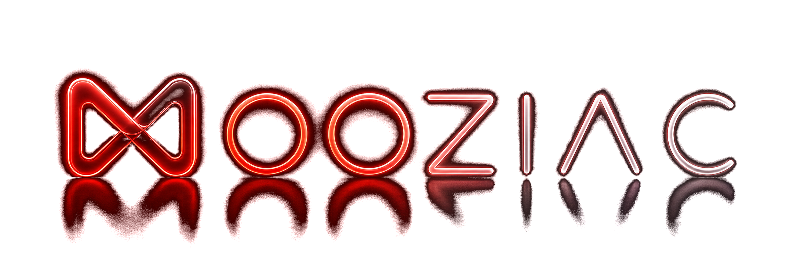
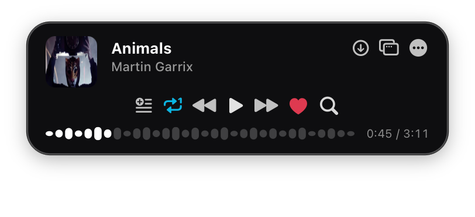

<p align="center">
  
</p>

<p align="center">
  <strong>A fast, distraction-free YouTube Music & local audio player tucked right into your Mac’s menu bar.</strong>
</p>

<p align="center">
  <a href="https://mooziac.threeten.site"></a>
  <a href="https://github.com/shirkeharsh/mooziac/releases/latest"></a>
  <a href="https://github.com/shirkeharsh/mooziac/releases/latest"></a>
  <a href="https://github.com/shirkeharsh/mooziac/releases/latest"></a>
  <a href="LICENSE"></a>
</p>

<p align="center">
  <a href="https://mooziac.threeten.site"><strong>🌐 Official Website</strong></a> •
  <a href="https://github.com/shirkeharsh/mooziac/releases/latest/download/Mooziac.dmg"><strong>⬇️ Download DMG</strong></a> •
  <a href="https://github.com/shirkeharsh/mooziac/releases/latest"><strong>📦 Release Notes</strong></a> •
  <a href="#-building-from-source"><strong>🛠️ Build from Source</strong></a>
</p>

<br>

<p align="center">
  
</p>

---

## 🎵 What is Mooziac?

**Mooziac** is an ultra-lightweight, open-source **macOS music player** engineered from the ground up as a **native macOS app** using **Swift** and **AppKit**. Instead of running heavy browser tabs or resource-hungry desktop wrappers, Mooziac sits discreetly in your Mac’s menu bar, giving you instant playback controls, **YouTube Music** integration, offline local audio playback, synchronized lyrics, and innovative trackpad edge volume gestures.

---

## 🌟 Comprehensive Feature Breakdown

### 1. 🏝️ Dynamic Island Media Player View
- **8px Grid Layout**: Strict alignment across 3 rows without overlap regardless of window sizing or track title length.
- **Interactive Waveform Progress Bar**: Renders real-time audio wave visualization with click-and-drag seeking.
- **Micro-Animations**: Spring pop and bounce animations on button interactions.
- **Dual Design Engine**: Toggle between **Adaptive Ambient Track Theme** (extracts primary color from album art) and **OLED Pitch Black Dark Mode**.

### 2. 🖐️ Multitouch Trackpad Gestures Engine
Interact with playback directly from your Mac’s trackpad without looking at the screen:
- **Right-Edge Volume Slider**: Slide your finger along the far-right 1mm of your trackpad to smoothly adjust system volume with tactile haptic feedback.
- **Corner Tap Navigation**: Double/triple tap corners to skip tracks or toggle play/pause.
- **Safety Clamp & ID Lock**: Touch ID matching and single-swipe clamping prevent false triggers or sudden volume jumps.

### 3. 🔄 YouTube Music Sync & Local Library
- **Account Sync**: Synchronize Liked Songs, custom playlists, and listening history.
- **Continuous Queue**: Seamlessly steps through Liked Songs and playlists.
- **Local Audio Player**: Full native support for offline MP3, FLAC, WAV, AAC, and M4A playback with `.lrc` synced lyrics.

### 4. 🎮 Discord Rich Presence
- Live IPC socket connection displaying currently playing track, artist, album art, and elapsed time on your Discord profile.

### 5. 🛡️ Privacy-First Guarantee
- **Zero Telemetry**: No analytics or background data collection.
- **Local Storage**: All playlists and data stay in your local SQLite database (`~/Library/Application Support/Mooziac/`).

---

## 📥 Installation & First-Time Launch

1. Download **[`Mooziac.dmg`](https://github.com/shirkeharsh/mooziac/releases/latest/download/Mooziac.dmg)** (or [`Mooziac.zip`](https://github.com/shirkeharsh/mooziac/releases/latest/download/Mooziac.zip)).
2. Open `Mooziac.dmg` and drag **Mooziac** into your **Applications** folder.

### 💡 First-Time Launch (macOS Gatekeeper)
Because Mooziac is distributed independently outside the Mac App Store, macOS will prompt you on first launch:
- **Option A (1-Click UI Approval)**: When the *“Mooziac Not Opened / Apple could not verify”* prompt appears, simply click **[Open Anyway]** (or go to *System Settings ➔ Privacy & Security* and click *Open Anyway*).
- **Option B (Terminal 1-Liner)**: Run this once in Terminal:
  ```bash
  xattr -cr /Applications/Mooziac.app
  ```

---

## 🛠️ Build & Release Pipeline

### Quick Launch (Development)
```bash
./build_app.sh
```
*Compiles release binary, creates `~/Applications/Mooziac.app`, codesigns with Hardened Runtime, and launches.*

### Production DMG Packaging
```bash
./mooziac.sh
```
*Compiles a **Universal 2 Binary** (`arm64` + `x86_64`), codesigns with Hardened Runtime entitlements, and packages a styled **`dist/Mooziac.dmg`** and **`dist/Mooziac.zip`** with Finder metadata and volume icons.*

---

## 🏗️ Source Code Layout

```
mp3kal/
├── Package.swift                         # Swift Package Manager Manifest
├── build_app.sh                          # Development build & launch script
├── mooziac.sh                            # Production Universal 2 DMG packager
├── Mooziac.entitlements                  # Hardened Runtime entitlements
├── github-release-repo/                  # Public closed-source distribution kit
├── Sources/
│   └── Mooziac/                          # Single SPM target (compiled recursively)
│       ├── App/                          # App lifecycle (main.swift, AppDelegate)
│       ├── Core/                         # Central controllers & state
│       │   ├── MainViewController.swift
│       │   ├── StatusItemManager/        # Menu bar item, panel & context menu
│       │   └── NowPlayingManager/        # Playback state, queue, controls, JS bridge
│       ├── Models/                       # Pure data types & enums (no AppKit)
│       ├── Managers/                     # Service singletons (DB, downloads, playlists, updates, RPC…)
│       ├── Audio/                        # Native playback & CoreAudio engines
│       ├── Views/                        # All NSView / NSViewController
│       ├── Web/                          # WebKit integration (YTMWebView, URLFilter)
│       ├── Input/                        # Trackpad gestures & global hotkeys
│       └── Support/                      # Shared extensions & helpers
└── Resources/                            # Icons, artwork, DMG background & HTML assets
```

---

## 📄 License

Distributed under the MIT License. Copyright © 2026 ThreeTen. All rights reserved.
