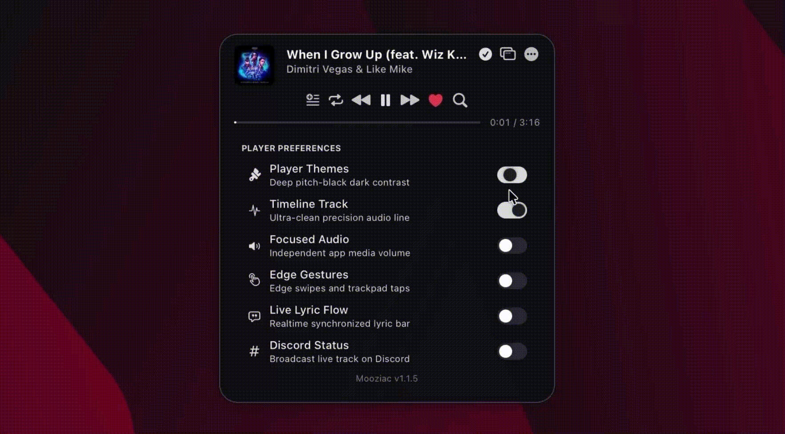

<p align="center">
  <a href="https://mooziac.threeten.site">
    
  </a>
</p>

<p align="center">
  <a href="https://github.com/shirkeharsh/mooziac/releases/latest"></a>
  <a href="https://github.com/shirkeharsh/mooziac/stargazers"></a>
  <a href="https://github.com/shirkeharsh/mooziac/releases/latest"></a>
  <a href="https://github.com/shirkeharsh/mooziac/releases/latest"></a>
  <a href="#-privacy-first-architecture"></a>
  <a href="LICENSE"></a>
</p>

<p align="center">
  <a href="https://github.com/shirkeharsh/mooziac/releases/latest/download/Mooziac.dmg">
    
  </a>
  &nbsp;&nbsp;
  <a href="https://github.com/shirkeharsh/mooziac/releases/latest/download/Mooziac.zip">
    
  </a>
  &nbsp;&nbsp;
  <a href="https://mooziac.threeten.site">
    
  </a>
</p>

<br>

<p align="center">
  <b>Mooziac is an ultra-lightweight, 100% native Swift & AppKit music player built specifically for macOS.</b><br>
  Tucked right into your menu bar, it combines YouTube Music streaming and local hi-res audio playback with an invisible trackpad edge volume slider, real-time synchronized lyrics, and zero battery-draining Electron bloat.
</p>

---

## ✨ See Mooziac in Action

<p align="center">
  
  <br>
  <sub><i>Interactive player preferences, themes, live audio waveforms, and native macOS menu bar playback controls.</i></sub>
</p>

---

## ⚡️ Why Mooziac?

Most desktop music players are heavy Electron wrappers that bundle a full Chromium browser, devouring system resources and draining laptop battery life. Mooziac was built from scratch in **pure native Swift and AppKit** with zero third-party dependencies.

| Feature | ⚡️ Mooziac | 🌐 Official YTM Web / Desktop | 📦 Electron Wrappers |
| :--- | :---: | :---: | :---: |
| **Technology** | **100% Native Swift & AppKit** | Chromium / Web App | Heavy Chromium + Node.js |
| **Trackpad Edge Volume** | **✅ Yes (with haptic feedback)** | ❌ No | ❌ No |
| **Synchronized Lyrics HUD** | **✅ Line-by-line LRC** | ⚠️ Basic / Unsynced | ❌ No |
| **Local Offline Audio** | **✅ FLAC, MP3, WAV, AAC, M4A** | ❌ Cloud only | ❌ No |
| **Background Media Keys** | **✅ Native macOS integration** | ⚠️ Browser permissions | ⚠️ Inconsistent |
| **Discord Rich Presence** | **✅ Native Unix socket (0 deps)** | ❌ No | ⚠️ Third-party plugins |
| **Telemetry & Privacy** | **🔒 100% Local (Zero tracking)** | ⚠️ Extensive Google telemetry | ⚠️ Varies |

---

## 🎛️ Core Highlights

<table>
  <tr>
    <td width="50%" valign="top">
      <h4>🎛️ Invisible Trackpad Volume Slider</h4>
      <p>Turn the rightmost 1mm border of your MacBook trackpad into an invisible hardware volume dial.</p>
      <ul>
        <li><b>1mm Border Edge:</b> Slide along the outer bezel for fine-grained system volume adjustment.</li>
        <li><b>Tactile Taptic Engine:</b> Real physical haptic ticks as volume levels increment or decrement.</li>
        <li><b>Zero Ghost Touches:</b> Palm and Touch ID rejection prevents accidental triggers during typing.</li>
      </ul>
    </td>
    <td width="50%" valign="top">
      <h4>🎤 Floating Synchronized Lyrics HUD</h4>
      <p>Sing along with real-time, line-by-line synchronized LRC lyrics right beneath your menu bar.</p>
      <ul>
        <li><b>Line-by-Line LRC:</b> Powered by LRCLib and native YouTube Music synced endpoints.</li>
        <li><b>Non-Intrusive HUD:</b> Floats discreetly without taking window focus or blocking your workspace.</li>
        <li><b>Instant Local Cache:</b> Stored in SQLite for zero-latency retrieval on repeat listens.</li>
      </ul>
    </td>
  </tr>
  <tr>
    <td width="50%" valign="top">
      <h4>⚡️ Dual Audio Engine (Cloud + Local Hi-Res)</h4>
      <p>Stream your cloud favorites or play lossless offline libraries in one seamless unified queue.</p>
      <ul>
        <li><b>YouTube Music Bridge:</b> Direct access to your cloud playlists, liked songs, and history.</li>
        <li><b>Lossless Hi-Res:</b> Pure <code>AVFoundation</code> playback supporting FLAC, ALAC, WAV, MP3, AAC, and M4A.</li>
        <li><b>Built-in Downloader:</b> Integrated <code>yt-dlp</code> pipeline with automatic tag and artwork embedding.</li>
      </ul>
    </td>
    <td width="50%" valign="top">
      <h4>🌊 Interactive Waveform & Adaptive Glow</h4>
      <p>Dynamic ambient interface that harmonizes with your music and desktop wallpaper.</p>
      <ul>
        <li><b>Live Audio Visualizer:</b> Interactive waveform scrub bar with real-time seeking.</li>
        <li><b>Adaptive Palette:</b> Real-time color sampling from active album artwork.</li>
        <li><b>Curated Themes:</b> OLED Pitch Black, Crystal Glass, and Liquid Fluid visual styles.</li>
      </ul>
    </td>
  </tr>
  <tr>
    <td width="50%" valign="top">
      <h4>🎮 Native Discord Rich Presence</h4>
      <p>Broadcast your now-playing status without third-party bloat or background daemons.</p>
      <ul>
        <li><b>Native Unix Socket IPC:</b> Direct connection with zero Node.js or Python runtime overhead.</li>
        <li><b>Rich Status Card:</b> Displays active song title, artist, album art, and live elapsed timestamps.</li>
        <li><b>Auto-Pause Sync:</b> Updates status in real time when playback is paused or resumed.</li>
      </ul>
    </td>
    <td width="50%" valign="top">
      <h4>🔒 100% Local & Privacy-First</h4>
      <p>Architected with strict privacy principles — your music and listening data remain strictly on your Mac.</p>
      <ul>
        <li><b>Zero Telemetry:</b> No analytics SDKs, trackers, beacons, or crash reporters phoning home.</li>
        <li><b>Local SQLite3:</b> History, likes, and cached playlists stay entirely in your local storage.</li>
        <li><b>Sandboxed WebKit:</b> Credentials remain safely inside Apple's official <code>WKWebsiteDataStore</code>.</li>
      </ul>
    </td>
  </tr>
</table>

---

## ⌨️ Gestures & Shortcuts

### Trackpad MultiTouch Gestures

| Gesture | Trackpad Region | Action |
| :--- | :--- | :--- |
| **Edge Slide** | Far-right 1mm border | Smooth volume adjustment with tactile haptics |
| **Double Tap** | Bottom-right corner | Next Track |
| **Triple Tap** | Bottom-right corner | Previous Track |
| **Double Tap** | Bottom-left corner | Play / Pause Toggle |
| **Scroll** | Over Menu Bar Icon | Fast Volume Stepping |

### Keyboard Shortcuts

| Shortcut | Action |
| :--- | :--- |
| `Space` | Play / Pause |
| `⌘ + Right Arrow` | Next Track |
| `⌘ + Left Arrow` | Previous Track |
| `L` | Like / Unlike Song |
| `⌘ + R` | Reload Web Engine |
| `⌘ + Q` | Quit Mooziac |

---

## 🚀 Installation

### Option 1: Homebrew (Recommended)

Install directly via the official Homebrew tap:

```bash
brew install shirkeharsh/tap/mooziac
```

To update in the future:
```bash
brew upgrade --cask mooziac
```

### Option 2: Direct Download

1. Download [`Mooziac.dmg`](https://github.com/shirkeharsh/mooziac/releases/latest/download/Mooziac.dmg) or [`Mooziac.zip`](https://github.com/shirkeharsh/mooziac/releases/latest/download/Mooziac.zip).
2. Open `Mooziac.dmg` and drag **Mooziac** into your **Applications** folder.
3. Launch Mooziac from Spotlight (`⌘ + Space`) or Launchpad.

> [!NOTE]
> **macOS Gatekeeper:** Because Mooziac is distributed directly outside the Mac App Store:
> - If macOS prompts that the app cannot be verified, go to **System Settings > Privacy & Security** and click **Open Anyway**.
> - Or run this one-line command in Terminal:
>   ```bash
>   xattr -cr /Applications/Mooziac.app
>   ```

---

## 🛠️ Building from Source

### Prerequisites
- macOS 13.0 (Ventura) or later
- Xcode 15+ or Xcode Command Line Tools (`xcode-select --install`)
- Swift 5.9+ toolchain

```bash
# Clone repository
git clone https://github.com/shirkeharsh/mooziac.git
cd mooziac

# Run unit tests
swift test --parallel

# Build and launch debug app locally
./build_app.sh

# Build universal release binary & DMG package
./build_app.sh --release-only
```

---

## 📂 Architecture and Project Structure

Mooziac is architected cleanly into modular Swift packages with native macOS frameworks:

```
Mooziac/
├── Package.swift                         # SPM Manifest (macOS 13+, Swift 5.9)
├── Mooziac.entitlements                  # Hardened Runtime security entitlements
├── build_app.sh                          # Universal build & packaging pipeline
├── Sources/Mooziac/                      # Main application target
│   ├── App/                              # Application lifecycle, AppDelegate, background media
│   ├── Audio/                            # CoreAudio volume hooks, AVFoundation audio player
│   ├── Core/                             # Central coordinators, NowPlaying, StatusItem
│   ├── Input/                            # MultiTouch gesture engine & global shortcuts
│   ├── Managers/                         # Local SQLite3, YTMClient, synced lyrics, yt-dlp
│   ├── Models/                           # State representations, playlist records, audio configs
│   ├── Views/                            # Dynamic Island player UI, waveform, lyrics HUD
│   └── Web/                              # Sandboxed WebKit bridge for YouTube Music
└── Tests/MooziacTests/                   # Parallelized unit test suite
```

---

## ⭐️ Support & Community

If you find Mooziac useful, please consider **starring the repository** — it helps more Mac users discover native, lightweight open-source software!

[](https://star-history.com/#shirkeharsh/mooziac&Date)

- 🐛 **Found a bug?** [Open an issue](https://github.com/shirkeharsh/mooziac/issues)
- 💡 **Have a feature idea?** [Submit a feature request](https://github.com/shirkeharsh/mooziac/issues/new)
- 🌐 **Official Website:** [mooziac.threeten.site](https://mooziac.threeten.site)

---

## 📄 License & Disclaimer

- **License:** Distributed under the [MIT License](LICENSE). Copyright © 2026 ThreeTen.
- **Disclaimer:** YouTube Music is a trademark of Google LLC. Mooziac is an independent open-source project and is not affiliated with, authorized, or endorsed by Google LLC.
